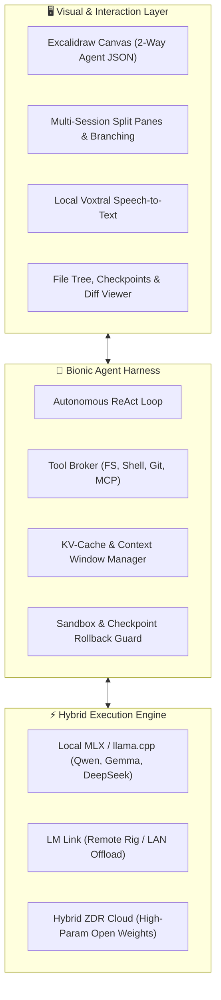

# ⚡ Bionic: Open-Weight Autonomous Agent Harness & Workspace

> **Complete system blueprint and step-by-step recreation guide for an open-weight, local-first alternative to Claude Code and OpenAI Codex.**  
> Based on the architectural extraction of **LM Studio Bionic** (featuring Apple Silicon MLX caching, bidirectional Excalidraw design canvas, and offline Voxtral voice dictation).

[](https://viorel-bionic-teardown.netlify.app)
[](LICENSE)
[](https://python.org)
[](https://tauri.app)
[](https://github.com/ml-explore/mlx)

---

## 🏛️ System Architecture



---

## 🚀 Quickstart & Build Instructions

Follow these instructions to set up the complete system locally.

### 1. Prerequisites
- **Node.js**: `v20.0.0+` & `pnpm` / `npm`
- **Rust**: `1.75+` (for Tauri desktop shell)
- **Python**: `3.11+`
- **Hardware**: Apple Silicon (M1/M2/M3/M4 with $\ge$16GB unified RAM recommended) or NVIDIA GPU with $\ge$16GB VRAM.

---

### 2. Local Inference Setup (Apple MLX or llama.cpp)

Run open-weight coding models locally without API keys or usage caps:

```bash
# Clone the repository
git clone https://github.com/ShawCole/bionic-agent-harness.git
cd bionic-agent-harness

# Set up Python virtual environment
python3 -m venv venv
source venv/bin/activate
pip install -r requirements.txt

# Launch local Apple MLX inference server with Qwen 2.5 Coder 32B (Q4)
python -m mlx_lm.server --model mlx-community/Qwen2.5-Coder-32B-Instruct-4bit --port 1234
```

*Alternatively, run LM Studio or `llama.cpp`:*
```bash
llama-server -m models/qwen2.5-coder-32b-instruct.Q4_K_M.gguf --port 1234 -c 32768 -ngl 99
```

---

### 3. Agent Core & Tool Broker

The agent core manages autonomous file reading, editing, diff patching, terminal command execution, and Excalidraw canvas syncing.

```bash
# Test the autonomous agent core
python src/agent_core.py --workspace . --model-endpoint http://localhost:1234/v1
```

---

### 4. Desktop Workspace Frontend (Tauri + React + Excalidraw)

```bash
# Navigate to web workspace
cd web
npm install

# Run in browser dev mode
npm run dev

# Or build native desktop application via Tauri
npm run tauri dev
```

---

### 5. Offline Voxtral Voice Dictation (Mistral GGUF)

```bash
# Run local speech-to-text service
python src/voxtral_stt.py --port 8765
```

---

### 6. Deploying Deliverable to Netlify

```bash
# Deploy static interactive deliverable directly to Netlify
npm run deploy:netlify
```

---

## 📦 Project Structure

```
├── README.md                           # Main architecture and build guide
├── LICENSE                             # MIT License
├── _headers                            # Netlify security and CORS configuration
├── index.html                          # Interactive deliverable & hardware calculator
├── docs/
│   ├── ARCHITECTURE.md                 # Deep-dive architecture specs
│   └── BUILD_GUIDE.md                  # Comprehensive step-by-step build manual
├── src/
│   ├── agent_core.py                   # ReAct loop, tool broker, AST diff engine
│   ├── mlx_inference_bridge.py         # MLX KV-cache inference client
│   └── voxtral_stt.py                  # Local offline speech-to-text worker
└── web/
    ├── package.json                    # Frontend dependencies
    └── src/                            # React & Excalidraw visual workspace
```

---

## 🛠️ Key Capabilities

* **Zero API Subscriptions:** Full coding autonomy on local hardware without rate limits or telemetry.
* **Excalidraw 2-Way Sync:** Structured JSON serialization allows the agent to visually design architectures, flows, and wireframes directly on the canvas.
* **Multi-Session Branching:** Split-pane execution with instant conversation forking for speculative bug fixes.
* **Fail-Closed Safety:** Automated git tree snapshots before every tool execution, enabling instant one-click rollbacks.

---

## 👥 Contributors & Acknowledgements
- **Target Audience / Collaborators:** Viorel & Shaw Cole
- **Inspiration:** LM Studio Bionic & Claude Code
